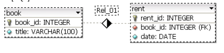
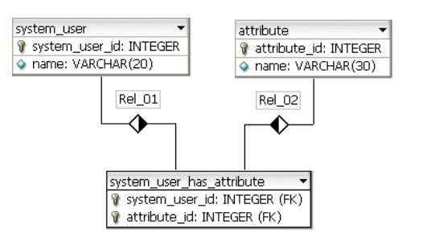

Instructions:
1) Write unit tests for function 'sum':
   ```php
   public function sum($a, $b)
   {
       if (!is_int($a) || !is_int($b)) {
           throw new InvalidArgumentException();
       }
       return $a + $b;
   }
   ```
   
   **Source code in App\Summary namespace and test in App\Tests\Summary**

2) You have an array with n numbers from -10 to 10 (without 0). Implement function which returns quantity of pairs
from the array which sum gives 0.
For example:
   ```php
    $input = array (3, 6, -3, 5, -10, 3, 10, 1, 7, -1, -9, -8, 7, 7, -7, -2, -7);
   ``` 
   The right answer is 5 (pairs are bolded)
   
   **Solution in App\QuantityOfPairs namespace with tests in App\Tests\QuantityOfPairs**

3) Design 'Aquarium' class system with given requirements:
   - we can put fish, turtles and plants in the aquarium
   - fish, turtles and plants must breathe
   - fish and turtles both must swim, but in a different ways
   - functionality to send mail and sms after we add anything to our aquarium
   - when light is on animals are swimming
   - we can install different aquarium filters, which has different methods
   - when we feed animals only hungry starts to eat
   - fish and turtles respond to different food types
   - heater can work in 3 different modes
    
    **Class system in App\Aquarium namespace**

4) Extract ALL books' titles with the number of rents in 2008 using SQL query. Relation in 
   
   **[Solution](src/book.sql)**

5) Using SQL query extract the list of users having exactly 3 defined attributes (i.e. with ID 1, 2, 4).
   Using only IDs from ‘system_user_has_attribute’ is good enough. Relation in 
   
   **[Solution](src/users.sql)**
